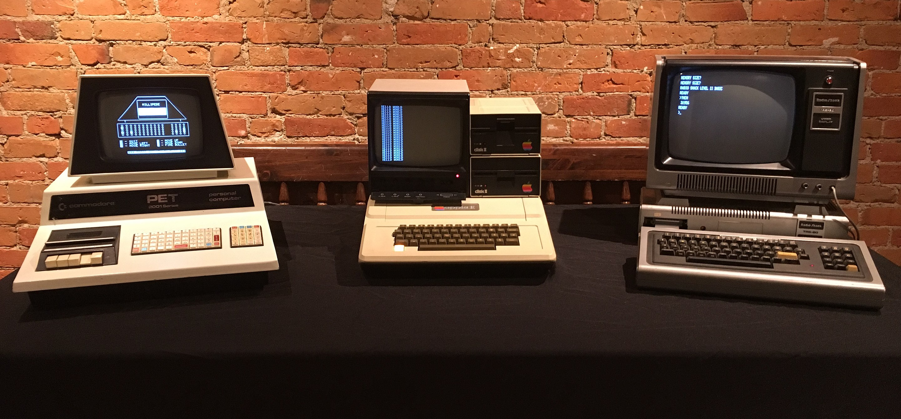

# Exercise 00 - Hello REE!

This first exercise is a warm-up exercise to get you started with the Coding Challenge 2022.

All you need to do is to print the string `Hello REE!` to the console as well as a delimiter before and after the message.

The delimiter is a string that consists of `n` characters that may be chosen arbitrarily but often used are `-` or `=`.

The default/maximum terminal width in the early days of UNIX was **80 characters**.



The template code includes a `#define` that defines the terminal width to be **80 characters**. Use that!

The output should look like this:

```
================================================================================
Hello REE!
================================================================================
```

And done!

### Happy coding!

And remember: **_Don't Panic!_**

## Where is the code?

Click on the `src` folder above. Then, click on the `main.c` file. This will open the template code in your browser. You can then copy/paste the code into your IDE or download the file.

## Intro video

[Watch the video on YouTube](https://youtu.be/sFyUag_d-tI)

## Solution video

Available on 23.12.2022.
