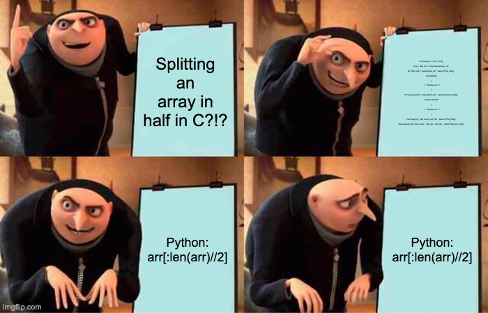

# Exercise 01 - \[Hu\]rraaaaaays Part I

[Watch this video first!](https://youtu.be/ClOBza7CfI0) <- Click here or on the thumbnail below!

[](https://www.youtube.com/watch?v=ClOBza7CfI0)

This exercises is all about **arrays**.

Count them, sort them, reverse them, print them, and **catch 'em all**!

Okay, we're not going to catch them, but we're going to print them.
This exercise is **Part I** of the **\[Hu\]rraaaaaays** series.



You can either continue working with your solution for Part II & Part III or simply use the solution code from Part I.

## Understand arrays in 15min! (by Harvard CS50)

Click on the thumbnail below to watch the video on YouTube.

It's a great video that explains arrays in a very simple way by CS50's Doug Lloyd at Harvard University.

[](https://www.youtube.com/watch?v=YdSycMcxvY0)

## The task

Watch the video first where I explain the task in detail.

You have to generate an array of `n` random numbers and do some maths with it.

The array should be filled with random numbers between `0` and `99` (both inclusive).

You then have to compute the `sum` and `average` of the array.

Next, you have to print the array to the console together with the `sum` and `average`.

And done!

### Happy coding!

And remember: **_Don't Panic!_**

## Where is the code?

### The template code

Click on the `src` folder above. Then, click on the `main.c` file. This will open the template code in your browser. You can then copy/paste the code into your IDE or download the file.

```sh
./src/main.c
```

### The solution code

The **solution code** is in the `solution` folder.

```sh
./solution/main.c
```

## Intro video

Will be available in a few minutes...

[Watch the video on YouTube](https://youtu.be/ClOBza7CfI0) <- Click here or on the thumbnail below!

[](https://www.youtube.com/watch?v=ClOBza7CfI0)

## Solution video

Available on 24.12.2022.
